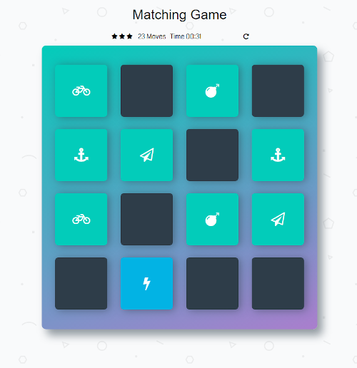

# Memory Game

## About the game

* There are 16 cards, 8 different pairs of pictures on the game board. At the start of the game, the cards are covered and placed randomly. The goal of the player is to uncover them all.

## Instructions
* The player flips the card by clicking on them. Only two cards are uncovered at the same time. If the cards match they stay uncovered if they don't the player has one second to remember them, after that the pictures are hidden again.

* Depending on the number of moves it took the player to finish the game he's rewarded with a star rating and a title.

* The player can reset the game by clicking the loop arrow. The cards will be covered and shuffled. The move counter and timer will be reset to zero.

## Source
Initial code by Udacity [link](https://github.com/udacity/fend-project-memory-game)
## Link to game

* [Memory Game](https://pressr2.github.io/Old-portfolio/memory_game/)