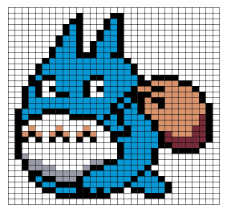

# Pixel Art Maker Project

## About
A single-page web app that allows users to create artistic designs on a customizable canvas.
The main goal of this project is to implement the `makeGrid()` function, that dynamically creates a grid the user can interact with.
## What I learned
* Defining variables with `const` and `let`.
* Interacting with the DOM via jQuery.
* Declaring functions and attaching them to DOM objects as event listeners.
* Writing nested loops and using loop variables.

## Capabilities
* Dynamically set the size of the width and height grid.
* Choose a color.
* Click a cell in the grid to fill that cell with the chosen color.
* Erase the color.

## Link to site
* [Pixel Art Maker](https://pressr2.github.io/Old-portfolio/pixel_art_maker/)

## Source
Initial code by [Udacity](https://github.com/udacity/project-pixel-art-maker-starter.git)
### Dependencies
jQuery